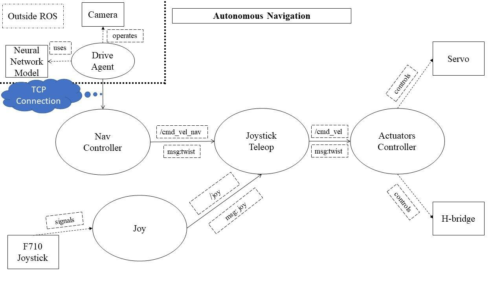

# Stable Baselines experimentation
This repository includes our CS3244 team's custom Gym environment that models the Autodrift Racing problem.

We make use of Stable-Baselines and Gym. Stable-Baselines is a library of Reinforcement Learning algorithms that specifically use Gym environments to operate.
Gym is a toolkit for developing and comparing reinforcement learning algorithms. 

This implementation uses the Soft-Actor Critic algorithm in our agent, which takes in images from a Raspberry Pi Camera and output steering directions.

## Model
 

The Gym environment replaces the Drive Agent (top-left), which then communicates with the Pi camera and receives feedback from the motorised car.